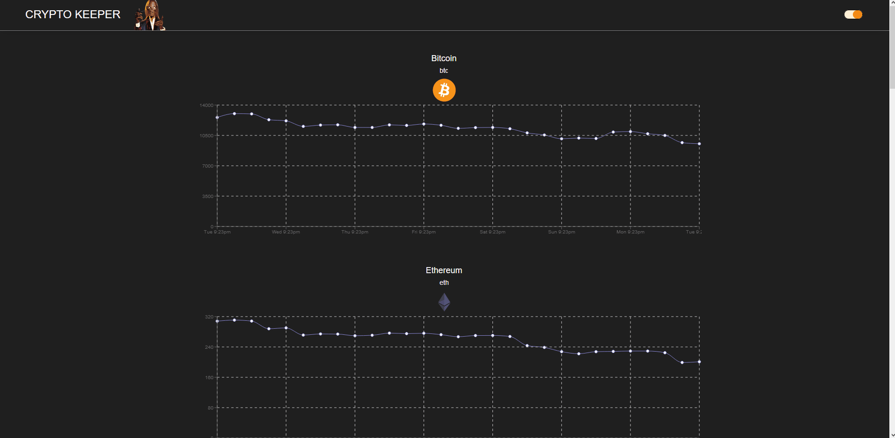

]

# Use Dark Mode

A custom [React Hook] (https://reactjs.org/docs/hooks-overview.html) to help you implement a "dark mode" component for your application.
The user setting persists to `localStorage`.

❤️ it? ⭐️ it on [GitHub](https://github.com/SirAndrewDillon/Andy-DarkMode-App/blob/andy-dillon/)
or [Tweet](https://twitter.com/) about it.

  
